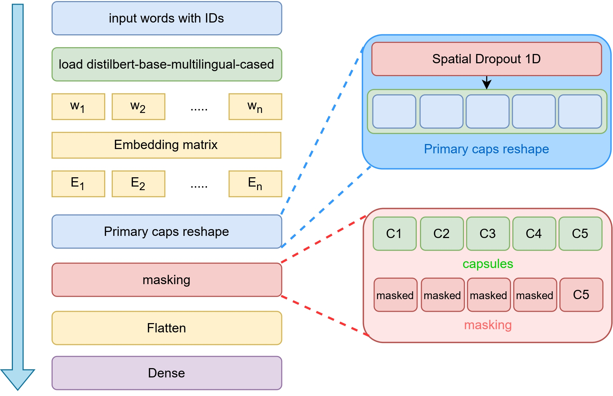
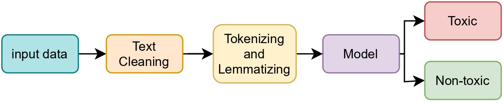
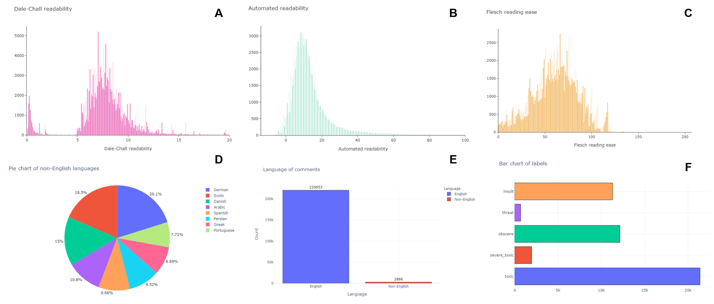
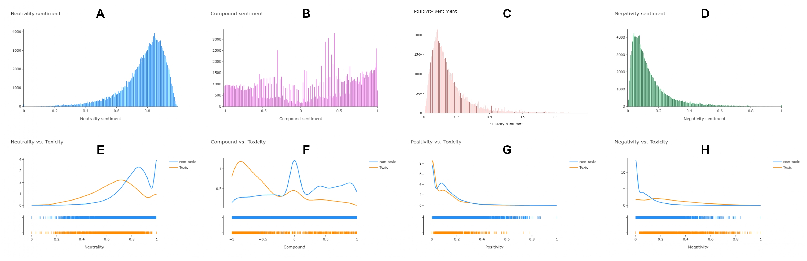
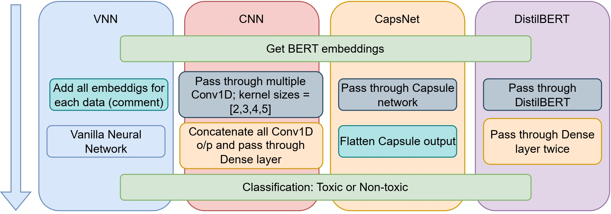

<div align="center">

<h2><a href="https://arxiv.org/abs/2303.11331">Evaluating The Effectiveness of Capsule Neural Network in Toxic Comment Classification using Pre-trained BERT Embeddings</a></h2>

[Md Habibur Rahman Sifat](https://github.com/Yuxin-CV)<sup>1</sup>, [Noor Hossain Nuri Sabab](https://github.com/Quan-Sun)<sup>2</sup>, [Tashin Ahmed](https://tashinahmed.github.io/)<sup>3</sup>
 
<sup>1</sup>[he Hong Kong Polytechnic University](habib.sifat@connect.polyu.hk), <sup>2</sup>[Department of CSE, UIU](nsabab@aol.com), <sup>3</sup>[Smart Studios](tashin@smartstudios.io)

</div>


Large language models (LLMs) have attracted considerable interest in the fields of natural language understanding (NLU) and natural language generation (NLG) since their introduction. In contrast, the legacy of Capsule Neural Networks (CapsNet) appears to have been largely forgotten amidst all of this excitement. This project’s objective is to reignite interest in CapsNet by reopening the previously closed studies and conducting a new research into CapsNet’s potential. We present a study where CapsNet is used to classify toxic text by leveraging pre-trained BERT embeddings (bert-baseuncased) on a large multilingual dataset. In this experiment, CapsNet was tasked with categorizing toxic text. By comparing the performance of CapsNet to that of other architectures, such as DistilBERT, Vanilla Neural Networks (VNN), and Convolutional Neural Networks (CNN), we were able to achieve an accuracy of **90.44%**. This result highlights the benefits of CapsNet over text data and suggests new ways to enhance their performance so that it is comparable to DistilBERT and other reduced architectures.


## Summary of the manuscript


Presented CapsNet architecture. The model takes word IDs as input and employs pre-trained BERT embeddings to extract context from text. A spatial dropout layer is applied to the BERT embeddings to prevent overfitting. The capsule layer receives the modified embeddings and learns to represent the input text as a collection of capsules, where each capsule represents a particular characteristic or attribute of the text. The capsule outputs are then fed into dense layers in order to learn higher-level text representations. The final dense layer generates the output prediction, which indicates the classification or label of the input text.


A straightforward general structure of the experiment that have been performed on the text data.


Metrics to assess the readabilty or ease of understanding texts. A: Dale-Chall readability; B: Automated readability; C: Flesch reading ease. D: Non English language percentages; E: English and non-English language count; F: Toxic class counts.


**Sentiments scores.** A: Neutrality; B: Compound; C: Positivity; D: Negativity. **Comparative analysis against toxicity.** (E: Neutrality, F: Compound, G: Positivity, H: Negativity) vs Toxicity


Basic architecture of all the models (VNN, CNN, CapsNet, DistilBERT) that tested till now. Common layer for every architecture are the BERT embeddings and classifier.


<!-- ## Get Started
- [Pre-training](asuka)
- [Image Classification](asuka)
- [Object Detection & Instance Segmentation](det)
- [Semantic Segmentation](seg)
- [CLIP](../EVA-CLIP) -->


<!-- ## Best Practice
- If you would like to use / fine-tune EVA-02 in your project, please start with **a shorter schedule & smaller learning rate** (compared with the baseline setting) first.
- Using EVA-02 as a feature extractor: https://github.com/baaivision/EVA/issues/56. -->

## BibTeX & Citation
TODO

<!-- ```
@article{EVA02,
  title={EVA-02: A Visual Representation for Neon Genesis},
  author={Fang, Yuxin and Sun, Quan and Wang, Xinggang and Huang, Tiejun and Wang, Xinlong and Cao, Yue},
  journal={arXiv preprint arXiv:2303.11331},
  year={2023}
}
``` -->

<!-- ## Acknowledgement
[EVA-01](https://github.com/baaivision/EVA/tree/master/EVA-01), [BEiT](https://github.com/microsoft/unilm/tree/master/beit), [BEiTv2](https://github.com/microsoft/unilm/tree/master/beit2), [CLIP](https://github.com/openai/CLIP), [MAE](https://github.com/facebookresearch/mae/), [timm](https://github.com/rwightman/pytorch-image-models), [DeepSpeed](https://github.com/microsoft/DeepSpeed), [Apex](https://github.com/NVIDIA/apex), [xFormer](https://github.com/facebookresearch/xformers), [detectron2](https://github.com/facebookresearch/detectron2), [mmcv](https://github.com/open-mmlab/mmcv), [mmdet](https://github.com/open-mmlab/mmdetection), [mmseg](https://github.com/open-mmlab/mmsegmentation), [ViT-Adapter](https://github.com/czczup/ViT-Adapter), [detrex](https://github.com/IDEA-Research/detrex), and [rotary-embedding-torch](https://github.com/lucidrains/rotary-embedding-torch). -->


<!-- ## Contact

- For help and issues associated with EVA-02, or reporting a bug, please open a [GitHub Issue with label EVA-02](https://github.com/baaivision/EVA/labels/EVA-02). 
Let's build a better & stronger EVA-02 together :)

- **We are hiring** at all levels at BAAI Vision Team, including full-time researchers, engineers and interns. 
If you are interested in working with us on **foundation model, self-supervised learning and multimodal learning**, please contact [Yue Cao](http://yue-cao.me/) (`caoyue@baai.ac.cn`) and [Xinlong Wang](https://www.xloong.wang/) (`wangxinlong@baai.ac.cn`). -->
